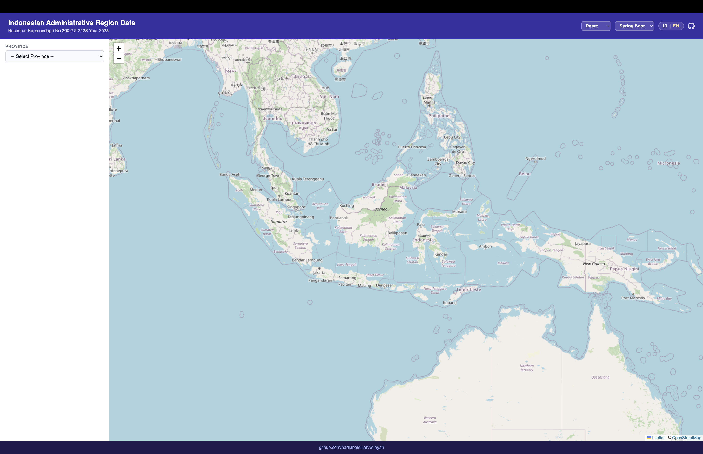

# WILAYAH INDONESIA 🇮🇩

[](LICENSE)
[](https://github.com/hadiubaidillah/wilayah/issues)
[](https://github.com/hadiubaidillah/wilayah/network)
[](https://github.com/hadiubaidillah/wilayah/stargazers)

API dan antarmuka web untuk data Kode dan Wilayah Administrasi Pemerintahan Indonesia sesuai **Kepmendagri No 300.2.2-2138 Tahun 2025**, dibangun dengan arsitektur multi-backend dan multi-frontend.

**Demo:** [https://wilayah.hadiubaidillah.com](https://wilayah.hadiubaidillah.com)

---

## Screenshot

### Spring Boot + React
[](.github/screenshots/react.png)

### Go + Angular
[](.github/screenshots/angular.png)

### Rust + Vue
[](.github/screenshots/vue.png)

---

## Arsitektur

```
wilayah/
├── database/                  # Database SQL (sumber: cahyadsn/wilayah)
├── backend/
│   ├── spring-boot/           # Java — Spring Boot 4 (port 8080)
│   ├── golang/                # Go — Gin (port 8081)
│   └── rust/                  # Rust — Axum (port 8082)
└── frontend/
    ├── react/                 # React 19 + Vite (port 5173)
    ├── vue/                   # Vue 3 + Vite (port 5174)
    └── angular/               # Angular 21 (port 4200)
```

Setiap frontend dapat terhubung ke backend manapun melalui **Backend Switcher** yang tersedia di header.

---

## Fitur

- Dropdown wilayah bertingkat: Provinsi → Kab/Kota → Kecamatan → Desa/Kelurahan
- Peta interaktif dengan polygon batas wilayah (Leaflet.js)
- Bilingual: Bahasa Indonesia / English (auto-detect berdasarkan bahasa browser)
- App switcher: pindah antar frontend (React / Angular / Vue) tanpa reload penuh
- Backend switcher: pindah antar backend (Spring Boot / Go Gin / Rust Axum)
- Data sesuai Kepmendagri No 300.2.2-2138 Tahun 2025

---

## API Endpoints

| Method | Endpoint | Deskripsi |
|--------|----------|-----------|
| GET | `/api/wilayah` | Daftar semua provinsi |
| GET | `/api/wilayah/:kode` | Detail wilayah + daftar anak wilayah |

**Contoh response `/api/wilayah/32`:**
```json
{
  "status": true,
  "data": {
    "kode": "32",
    "nama": "Jawa Barat",
    "lat": -6.9,
    "lng": 107.6,
    "luas": 37053.331,
    "penduduk": 51316378,
    "path": "..."
  },
  "children": [
    { "kode": "32.01", "nama": "Kabupaten Bogor" },
    ...
  ]
}
```

---

## Menjalankan Backend

### Spring Boot (port 8080)
```bash
cd backend/spring-boot
mvn spring-boot:run
```

### Go — Gin (port 8081)
```bash
cd backend/golang
go run main.go
```

### Rust — Axum (port 8082)
```bash
cd backend/rust
cargo run
```

**Konfigurasi database** (env vars, default sudah diset):

| Variabel | Default |
|----------|---------|
| `DB_HOST` | `localhost` |
| `DB_PORT` | `3306` |
| `DB_USER` | `wilayah` |
| `DB_PASS` | *(lihat config)* |
| `DB_NAME` | `wilayah` |
| `SERVER_PORT` | `8080` / `8081` / `8082` |

---

## Menjalankan Frontend

### React (port 5173)
```bash
cd frontend/react
npm install
npm run dev
```

### Vue (port 5174)
```bash
cd frontend/vue
npm install
npm run dev
```

### Angular (port 4200)
```bash
cd frontend/angular
npm install
ng serve --port 4200 --proxy-config proxy.conf.json
```

---

## Database

Database `wilayah` menggunakan MySQL. Import file SQL:

```bash
mysql -u root -p wilayah < database/wilayah.sql
mysql -u root -p wilayah < database/wilayah_level_1_2.sql
```

**Tabel utama yang digunakan:** `wilayah_level_1_2`

| Kolom | Tipe | Keterangan |
|-------|------|------------|
| `kode` | varchar | Kode wilayah (2=prov, 5=kab/kota, 8=kec, 13=desa) |
| `nama` | varchar | Nama wilayah |
| `lat` | double | Latitude |
| `lng` | double | Longitude |
| `path` | longtext | GeoJSON polygon batas wilayah |
| `luas` | double | Luas wilayah (km²) |
| `penduduk` | double | Jumlah penduduk |

---

## Kodefikasi Wilayah

| Tingkat | Panjang Kode | Contoh |
|---------|-------------|--------|
| Provinsi | 2 digit | `32` |
| Kab/Kota | 5 digit | `32.01` |
| Kecamatan | 8 digit | `32.01.01` |
| Desa/Kelurahan | 13 digit | `32.01.01.2001` |

---

## Data Kepmendagri No 300.2.2-2138 Tahun 2025

| id_prov | nama                       | kab   | kota  | kec  | kel   | desa  |    luas     | penduduk  | pulau  |
|---------|----------------------------|------:|------:|-----:|------:|------:|------------:|----------:|-------:|
| 11      | Aceh*                      |   18  |    5  | 290  |    0  | 6500  |   56835.019 |   5623479 |   365* |
| 12      | Sumatera Utara             |   25  |    8  | 455  |  693  | 5417  |   72437.755 |  15640905 |   228  |
| 13      | Sumatera Barat             |   12  |    7  | 179  |  230  | 1035  |   42107.674 |   5820359 |   219  |
| 14      | Riau                       |   10  |    2  | 172  |  271  | 1591  |   89900.780 |   7099297 |   144  |
| 15      | Jambi                      |    9  |    2  | 144  |  171  | 1414  |   49023.037 |   3834439 |    14  |
| 16      | Sumatera Selatan*          |   13  |    4  | 241  |  403  | 2856* |   86771.918 |   9064690 |    24  |
| 17      | Bengkulu                   |    9  |    1  | 129  |  172  | 1341  |   20122.210 |   2127957 |     9  |
| 18      | Lampung                    |   13  |    2  | 229  |  205  | 2446  |   33570.758 |   9144263 |   172  |
| 19      | Kepulauan Bangka Belitung* |    6  |    1  |  47  |   84  |  309  |   16670.225 |   1549562 |   501* |
| 21      | Kepulauan Riau             |    5  |    2  |  80  |  144  |  275  |    8170.375 |   2271890 |  2028  |
| 31      | DKI Jakarta                |    1  |    5  |  44  |  267  |    0  |     661.530 |  11038216 |   113  |
| 32      | Jawa Barat                 |   18  |    9  | 627  |  646  | 5311  |   37053.331 |  51316378 |    30  |
| 33      | Jawa Tengah                |   29  |    6  | 576  |  753  | 7810  |   34347.428 |  38430645 |    71  |
| 34      | DI Yogyakarta*             |    4  |    1  |  78  |   46  |  392  |    3170.363 |   3743365 |    37* |
| 35      | Jawa Timur*                |   29  |    9  | 666  |  773  | 7721  |   48055.876 |  41919906 |   538* |
| 36      | Banten*                    |    4  |    4  | 155  |  314  | 1238  |    9355.763 |  12881374 |    80* |
| 51      | Bali*                      |    8  |    1  |  57  |   80  |  636  |    5582.827 |   4375263 |    41* |
| 52      | Nusa Tenggara Barat*       |    8  |    2  | 117  |  145  | 1021  |   19631.991 |   5751295 |   430* |
| 53      | Nusa Tenggara Timur*       |   21  |    1  | 315  |  305  | 3137  |   46378.105 |   5700772 |   653* |
| 61      | Kalimantan Barat*          |   12  |    2  | 174  |   99  | 2046  |  147018.063 |   5646268 |   260* |
| 62      | Kalimantan Tengah          |   13  |    1  | 136  |  139  | 1432  |  153430.363 |   2825290 |    71  |
| 63      | Kalimantan Selatan         |   11  |    2  | 156  |  144  | 1872  |   37125.426 |   4305281 |   165  |
| 64      | Kalimantan Timur*          |    7  |    3  | 105  |  197  |  841  |  126951.758 |   4123303 |   244* |
| 65      | Kalimantan Utara           |    4  |    1  |  55  |   35  |  447  |   69900.886 |    770627 |   196  |
| 71      | Sulawesi Utara*            |   11  |    4  | 171  |  332  | 1507  |   14488.429 |   2645291 |   382* |
| 72      | Sulawesi Tengah*           |   12  |    1  | 177* |  175  | 1842  |   61496.983 |   3219494 |  1600* |
| 73      | Sulawesi Selatan*          |   21  |    3  | 313  |  793  | 2266  |   45323.975 |   9528276 |   394* |
| 74      | Sulawesi Tenggara*         |   15  |    2  | 221  |  377* | 1908  |   36139.303 |   2824589 |   591* |
| 75      | Gorontalo                  |    5  |    1  |  77  |   72  |  657  |   12024.982 |   1250960 |   127  |
| 76      | Sulawesi Barat             |    6  |    0  |  69  |   73  |  575  |   16590.667 |   1466741 |    69  |
| 81      | Maluku*                    |    9  |    2  | 119* |   35  | 1200  |   46133.832 |   1935586 |  1422* |
| 82      | Maluku Utara*              |    8  |    2  | 118  |  118  | 1067  |   31465.977 |   1394231 |   975* |
| 91      | Papua*                     |    8  |    1  | 105  |   51  |  948  |   81383.315 |   1102360 |   544* |
| 92      | Papua Barat*               |    7* |    0* |  91* |   21* |  803* |   60308.590 |    576255 |  1498* |
| 93      | Papua Selatan              |    4  |    0  |  82  |   13  |  677  |  117858.969 |    562220 |     7  |
| 94      | Papua Tengah               |    8  |    0  | 131  |   36  | 1172  |   61079.587 |   1369112 |    50  |
| 95      | Papua Pegunungan           |    8  |    0  | 252  |   10  | 2617  |   52508.656 |   1470518 |     0  |
| 96+     | Papua Barat Daya+          |    5+ |    1+ | 132+ |   74+ |  939+ |   39103.058 |    623186 |  3082+ |
|         | **TOTAL***                 |  416  |   98  |7285* | 8496* |75266* | 1890179.784 | 284973643 | 17380* |

**Catatan:**
- `)*` data mengalami perubahan dari data sebelumnya (Kepmendagri No. 100.1.1-6117 Tahun 2022)
- `)+` data baru dari Kepmendagri No. 300.2.2-2138 Tahun 2025
- Luas wilayah (km²) bersumber dari Badan Informasi Geospasial (Surat Deputi No. B-16.10/DIGD-BIG/IGD.04.04/12/2024)
- Jumlah penduduk bersumber dari Ditjen Dukcapil Kemendagri (Data Semester II Desember 2024)
- Jumlah pulau termasuk 6 pulau besar (Sumatera, Jawa, Kalimantan, Sulawesi, Timor, dan Papua)
- Sumber data pulau: Gazeter Republik Indonesia (GRI) Tahun 2024 oleh Badan Informasi Geospasial (BIG)

---

## Referensi Data

- Keputusan Menteri Dalam Negeri No 300.2.2-2138 Tahun 2025 tentang Pemberian Dan Pemutakhiran Kode, Data Wilayah Administrasi Pemerintahan, Dan Pulau
- Data polygon: [Badan Informasi Geospasial](https://tanahair.indonesia.go.id)
- Data koordinat: Google Maps

---

## Kredit

Database SQL bersumber dari proyek **[cahyadsn/wilayah](https://github.com/cahyadsn/wilayah)** oleh [Cahya DSN](https://github.com/cahyadsn), dilisensikan di bawah [MIT License](https://github.com/cahyadsn/wilayah/blob/master/LICENSE).

Backend dan frontend ditulis ulang sepenuhnya oleh [@hadiubaidillah](https://github.com/hadiubaidillah).

---

## Lisensi

Kode pada repositori ini dilisensikan di bawah [MIT License](LICENSE).
